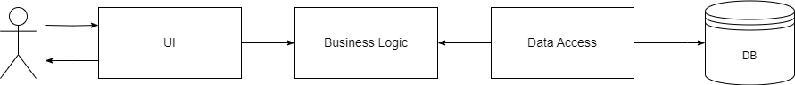
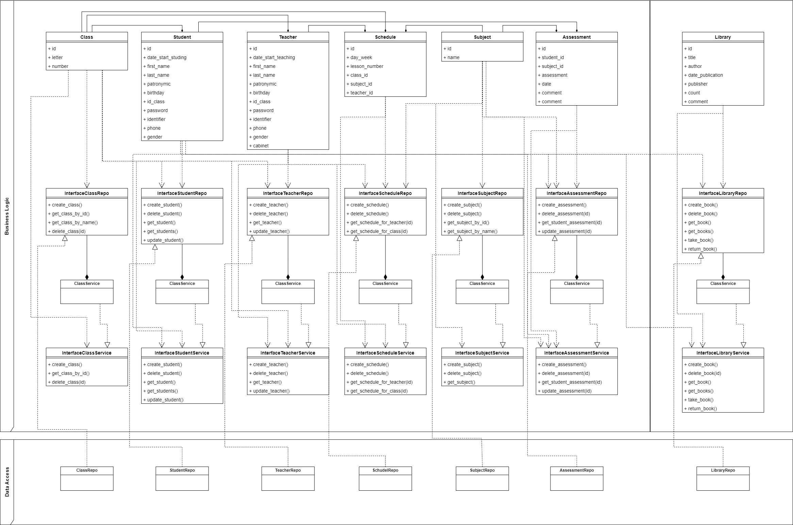
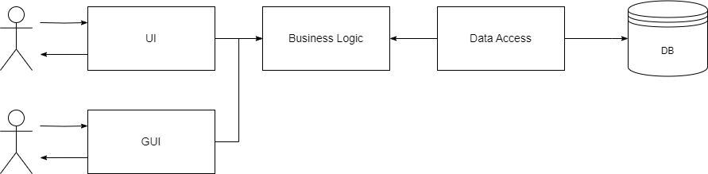
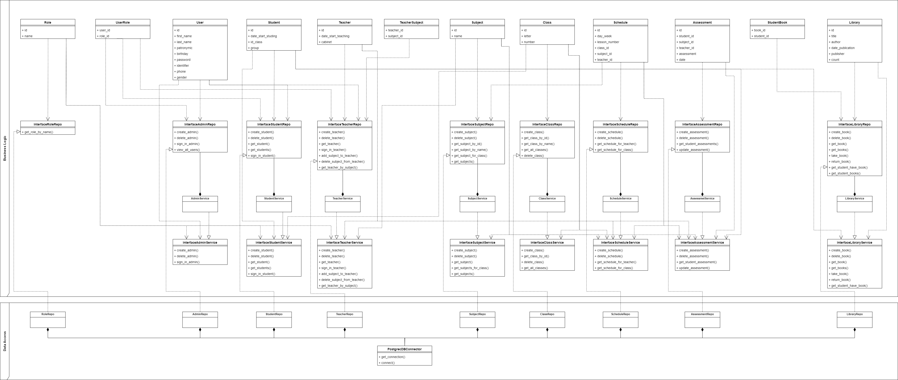

# SchoolView

## Название: **Сайт электронного дневника**

## **Краткое описание идеи проекта**

Web-приложение, на котором будет располагаться информация для учеников и учителей школы. 
Основная идея заключается в том, чтобы ученики могли удобно смотреть свою успеваемость, домашнее задание и расписание. 
Учителя способны выставлять оценки ученикам, задавать домашнее задание и оставлять коментарий/замечание. 
Администратор может регистрировать/удалять новых учеников и учителей.

## **Краткое описание предметной области**
Предметная область включает в себя электронный дневник. В школе плоходят уроки по различным предметам, причем уроки не должны пересекаться, на уроке должен быть только один учитель и не менее одного ученика.
Ключевым моментом является формирование отчетов и анализ статистики полученных.

## **Краткий анализ аналогичных решений**

|Название|Личный кабинет|Формирование отчетов|Домашнее задание|Смс–сервис|
|--------|----------|-------------|--------------|--------------|
|NetSchool|+|+|+|платно|
|Дневник.ру|+|+|+|-|
|Аверс|-|+|+|-|
|Мой проект|+|+|+|+|

## **Краткое обоснование целесообразности и актуальности проекта**

Актуальность проекта заключается в необходимости удобного приложения для одобного процесса обучения.
В наши дни появляется большое количество разнообразных онлайн школ/курсов, поэтому возникает необходимость электронного дневника: просмотр полученных оценок, расписания и домашнего задания. 

## Краткое описание акторов

1. Ученик может только просматривать информацию: свои оценки, посещаемость, расписание, домашнее задание и дневник.
2. Учитель может просматривать и выставлять оценки классу или студенту по своему предмету, добавлять и изменять домашнее задание, смотреть свое расписание. Он также может оставлять замечание или комментарий ученику.
3. Администратор может делать все тоже что и учитель, а также добавлять новых учителей и учеников (регистрировать), изменять их роли, а также дабавлять и изменять расписание.

## **Use-Case**

## Краткое описание сложных бизнес-правил

1. Создание рассписания.
Рассписание может создавать пользователь, имеющий учетную запись администратора. Расписание должно быть созданно на каждый рабочий день недели для каждого класса. В день у класса может быть от 5 до 8 уроков. В один день и в одно время не может быть два и более урока для класса или учителя. Предмет может вести только один учитель (т.е. два учителя не могут вести один и тот же предмет у одного класса), за исключением уроков, на которых класс делится на группы (англ. яз., информатика и т.д.). Кабинет проведения урока закреплен за учителем. Предметы должны соответсвовать программе класса.

2. Выставление оценки.
Выставлять оценки может пользователь, имеющий учетную запись администратора или учителя. Для этого необходимо перейти на страницу выставления оценок, где необходимо выбрать класс и предмет. Далее в открывшейся таблице необходимо добавить дату, если ее нет, после чего у данном столбце выбрать необходимого ученика и написать оценку. Оценка может быть только целы числом от 2 до 5 включительно. Оценку классу может ставить только учитель, который преподает данный предмет в этом классе.

3. Авторизация.
Автооризироваться может пользователь, который уже имеет учетную запись администратора, учителя или ученика. При открытии веб-сайта сразу открывается окно авторизации, где необходимо ввести логин и пароль. Если данная учетная запись существует, то авторизация прошла успешно, иначе нет.

4. Регистрация нового пользователя.
Регистрировать нового пользователя может только пользователь, имеющий учетную запись администратора. Для этого необходимо указать всю информацию пользователя, и выдать его логин и пароль. Логин: <ФИО><год_поступления(две посл. цифры)><буква класса><номер_ученика>. Пароль: <имя><номер_ученика><буква класса>. 

5. Оформление книги.
Оформить книгу может пользователь, имеющий учетную запись ученика. Для этого необходимо указать название книги. Если данная книга имеется в библеотеке, количество экземпляров данной книги больше 0, данная книга не была оформлена этим пользователем ранее, то ученик успешно оформляет книгу, иначе нет. 

### **ER-диаграмма сущностей**

### **Пользовательские сценарии**

Ученик может зайти на сайт приложения и:
1. Зайти на страницу авторизации и авторизироваться.
2. Авторизоваться, зайти на страницу своего профиля.
3. Авторизоваться, зайти на страницу дневника.
4. Авторизоваться, зайти на страницу формирования отчетов об успеваемости/посещаемости.
5. Авторизоваться, зайти на страницу расписания.
6. Авторизоваться и сделать что-то из предыдущих действий или ни одно из них, выйти из аккаунта.

Учитель может зайти на сайт приложения и:
1. Зайти на страницу авторизации и авторизироваться.
2. Авторизоваться, зайти на страницу своего профиля.
3. Авторизоваться, зайти на страницу выставления оценок.
4. Авторизоваться, зайти на страницу создания домашнего задания.
5. Авторизоваться, зайти на страницу формирования отчетов об успеваемости/посещаемости.
6. Авторизоваться, зайти на страницу расписания.
7. Авторизоваться и сделать что-то из предыдущих действий или ни одно из них, выйти из аккаунта.

Администратор может зайти на сайт приложения и:
1. Зайти на страницу авторизации и авторизироваться.
2. Авторизоваться, зайти на страницу своего профиля.
3. Авторизоваться, зайти на страницу выставления оценок.
4. Авторизоваться, зайти на страницу создания домашнего задания.
5. Авторизоваться, зайти на страницу формирования отчетов об успеваемости/посещаемости.
6. Авторизоваться, зайти на страницу расписания.
7. Авторизоваться, зайти на страницу регистрации нового пользователя.
8. Авторизоваться, зайти на страницу изменения данных пользователя.
9. Авторизоваться и сделать что-то из предыдущих действий или ни одно из них, выйти из аккаунта.

## **Формализация бизнес-правил**

## **Описание типа приложения и выбранного технологического стека**
Тип приложения: Web Application  
Язык: Kotlin   
СУБД: PostgreSQL + PgAdmin4  

## **Верхнеуровневое разбиение на компоненты**

## **UML диаграмма классов**

## **Верхнеуровневое разбиение на компоненты**

## **UML диаграмма классов**

## **UML диаграмма классов**

